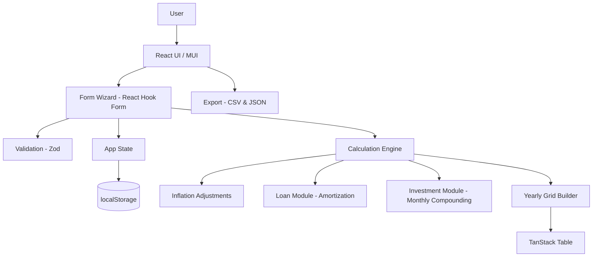
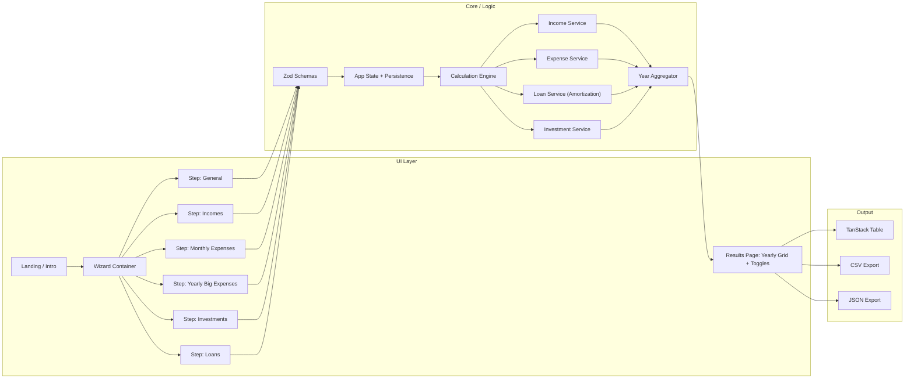
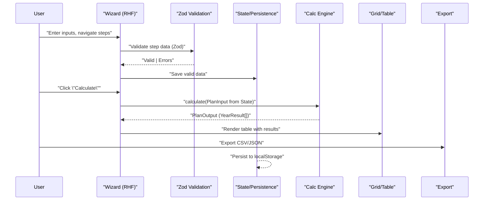
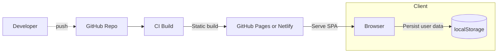
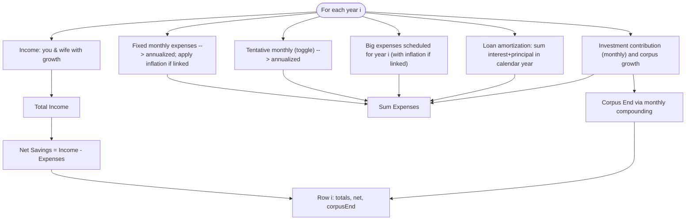

# Architecture – Joint Portfolio Planner

This document provides a standalone architecture view using Mermaid diagrams.

## 1) High-Level System Architecture

## 2) Component Breakdown

## 3) Data Flow (End-to-End)

## 4) Deployment Topology

## 5) Yearly Computation Overview

## 6) Technology Choices & Rationale

This section explains the logical reasoning behind the major technology decisions in the app.

- React + TypeScript
  - Why: React’s declarative component model maps cleanly to a multi-step planner UI. TypeScript provides compile-time safety across form schemas, calculation logic, and inter-component contracts. This is critical for financial calculations where silent runtime errors are costly.
  - Trade-offs: Slight overhead to learn generics and types, but catches entire classes of bugs (e.g., schema drift) early.

- Vite (build/dev)
  - Why: Vite provides instant dev server startup, HMR, and first-class TypeScript support. Its Rollup-based build allows fine-grained code splitting.
  - What we did: Lazy-loaded the Charts route to keep initial bundles smaller, and used manualChunks to split heavy vendors (Recharts, MUI, date-fns, React).
  - Result: Faster TTI for planner screens; charts code only loads on demand.

- React Hook Form + Zod (forms and validation)
  - Why: RHF minimizes re-renders and handles large forms efficiently. Zod enables schema-first validation that doubles as a source of truth for types.
  - Result: Consistent validation across steps, less boilerplate, high performance under typing.

- MUI (Material UI)
  - Why: Production-ready components with accessibility and responsive layout built-in. It speeds delivery while maintaining a consistent design system.
  - Trade-offs: Additional bundle weight mitigated via vendor code splitting and lazy loading heavy pages.

- Zustand (state)
  - Why: Lightweight global store for plan state, toggle flags, and arrays like per-year growth rates and prepayment. No ceremony compared to Redux for a single-user, client-only SPA.
  - Result: Simple mental model: Store holds the plan, wizard edits it, results/graphs render from it.

- TanStack Table (results grid)
  - Why: Declarative column definitions, sorting, and cell rendering. Works well with a transposed “metrics × years” presentation and inline editing controls.
  - Result: Clear, interactive yearly view with minimal custom table plumbing.

- date-fns (time utilities)
  - Why: Small, tree-shakeable utilities for monthly/annual loops and date math (e.g., amortization timelines) without mutable global state.
  - Result: Predictable computations, easy to reason about.

- Recharts (charts)
  - Why: Declarative charts fit React mental model and provide responsive containers and common chart types (line/bar/area) out of the box.
  - Result: Fast path to visualizing totals (income, expenses, home loan, savings, corpus) with switchable chart types.

- CSV/JSON export
  - Why: Client-only export preserves privacy; users can share or archive data offline without a backend.
  - Result: Zero server dependency for core workflows; easy import path via Landing.

- Indian number/currency formatting
  - Why: The target audience uses Indian digit grouping and INR currency. Format-on-blur + parse-on-change improves readability while keeping input editing ergonomic.
  - How: Intl.NumberFormat with en-IN locale; fallback manual grouping. Formatted inputs preserve caret position while typing.

- Architecture (client-only SPA)
  - Why: Immediate responsiveness, zero infra to deploy, and reduced complexity for a personal finance tool. Local persistence (as needed) keeps user data on device.
  - Trade-offs: Heavy computations must remain performant on modest hardware; mitigated by using iterative loops, memoization where appropriate, and avoiding unnecessary re-renders.

- Performance considerations
  - Code splitting: Charts lazy-loaded; vendor chunk splitting for MUI/Recharts/date-fns/react.
  - RHF minimal re-renders and controlled inputs strategy.
  - Simple amortization and yearly loops (O(years × months)) are kept readable and optimized enough for planner horizons.

- Alternatives considered
  - Formik/Yup: More boilerplate and re-renders vs RHF/Zod.
  - Redux: Overkill for a single-page planner; Zustand is simpler and sufficient.
  - Chart.js/ECharts: Powerful, but Recharts is simpler with strong React ergonomics.
  - Next.js/SSR: Not necessary for a purely client-side planner without SEO concerns.

- Maintainability & DX
  - TypeScript + Zod schemas keep types aligned with validation.
  - Encapsulated components (e.g., formatted inputs) centralize cross-cutting concerns (formatting/parsing/caret management).
  - Configuration (Vite) explicitly documents chunking decisions to educate future contributors.

## Notes
- Input validation is schema-driven (Zod) and integrated with React Hook Form.
- All calculations are deterministic and recomputed on input changes or toggles.
- Data is stored locally (no backend) enabling privacy and instant performance.
- Exports are generated client-side.

See also:
- docs/mermaid.md for full diagram set (flow, domain model, sequences, Gantt)
- README.md for project overview and setup
