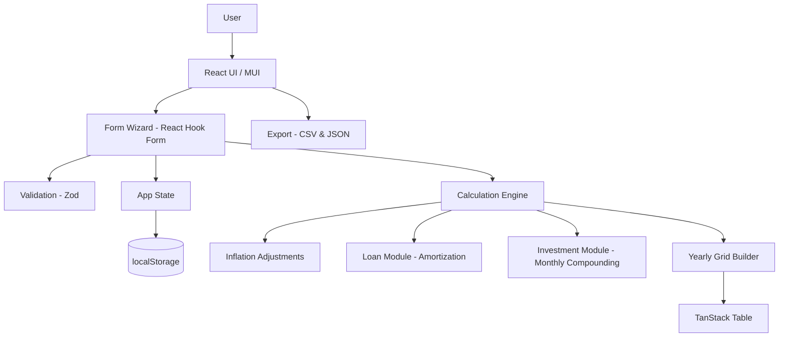
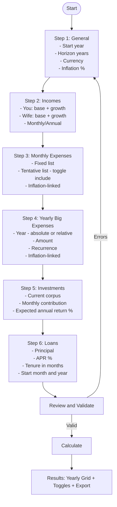
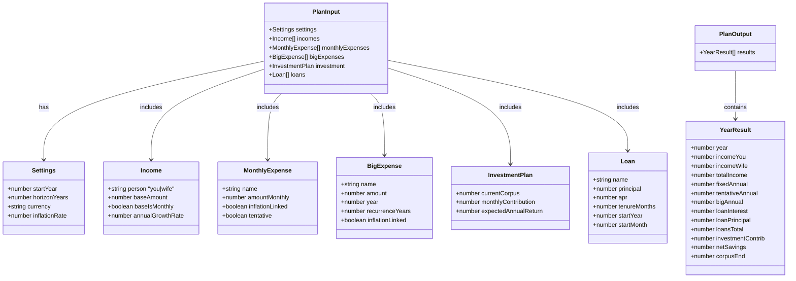
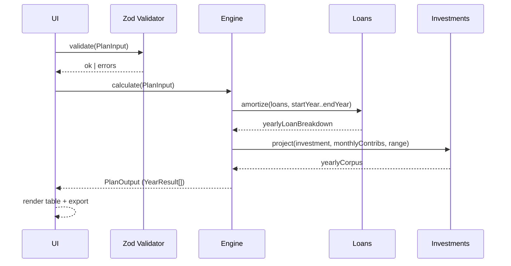
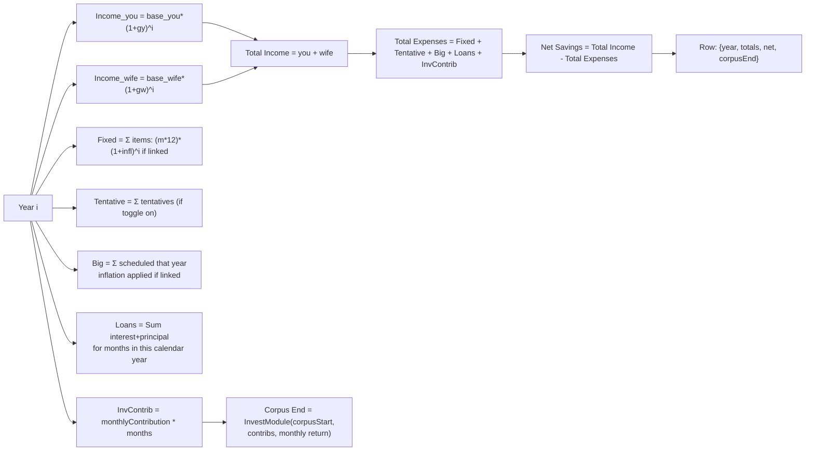
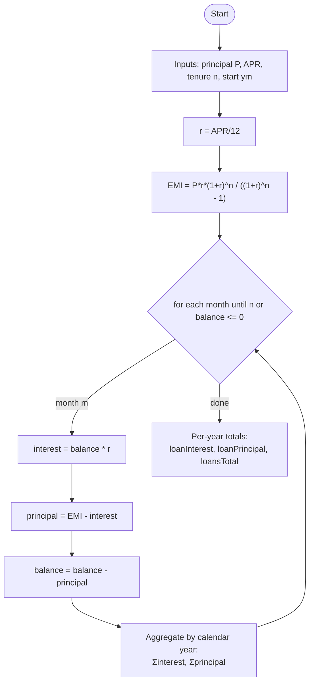
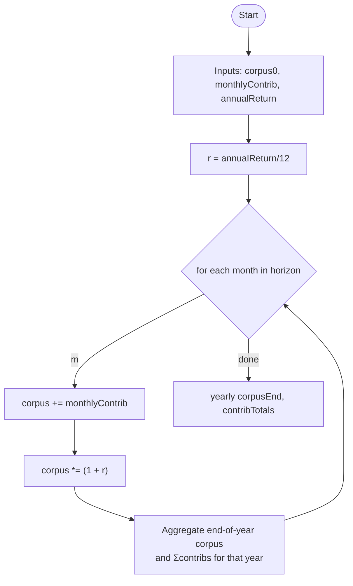
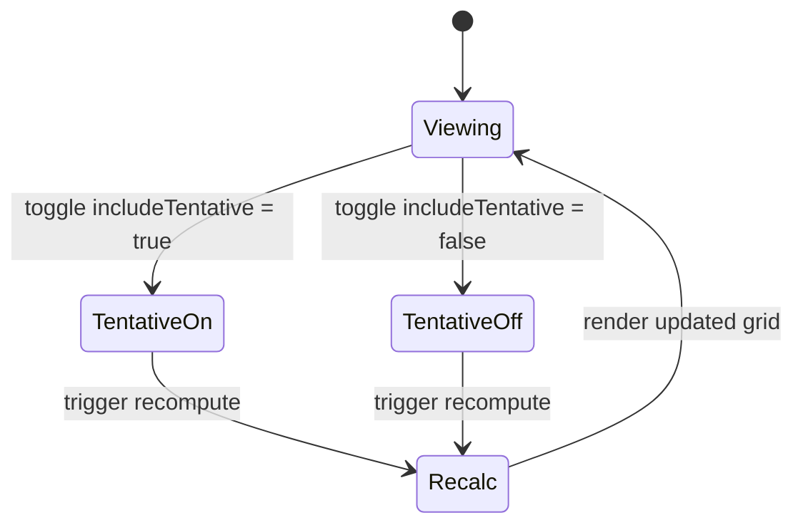
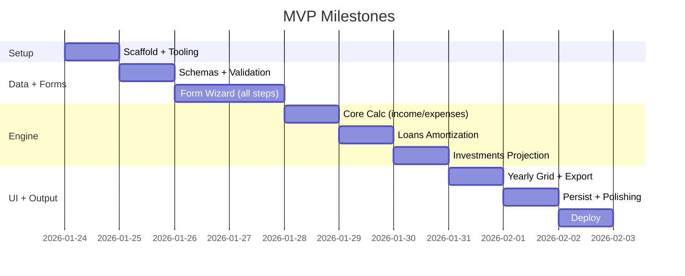

# Portfolio Planner – Mermaid Documentation

This document captures the planned system using Mermaid diagrams for quick, visual understanding.

## 1) System Overview (Architecture)

## 2) Wizard / User Flow

## 3) Domain Model (Types)

## 4) End-to-End Calculation Sequence

## 5) Yearly Grid Build (Per Year)

## 6) Loan Amortization Logic

## 7) Investment Projection (Monthly Compounding)

## 8) Tentative Expense Toggle State

## 9) Delivery Plan (Gantt)

### Rendering Tips
- Use a Mermaid-enabled Markdown preview (e.g., VSCode with “Markdown Preview Mermaid Support”).
- For GitHub, consider embedding via a site that renders Mermaid or use a static site build step that converts Mermaid to SVG.
